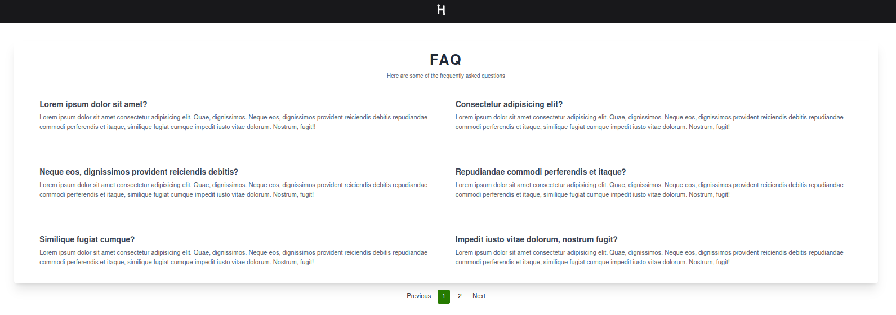

# Hubsys FAQ
Project to create a FAQ page for Hubsys

## Dependencies
- [PHP >=8.1](https://www.php.net/)
- [Composer](https://getcomposer.org/)
- [NPM](https://www.npmjs.com/)
- [Laravel >=10](https://laravel.com/docs/10.x/installation)

## Main packages
- [Laravel](https://laravel.com/)
- [VueJs](https://vuejs.org/)
- [Axios](https://axios-http.com/)
- [TailwindCSS](https://tailwindcss.com/)

## Instalation
1. Clone this repository
2. Run `composer install` to install dependencies
3. Run `php artisan key:generate` to generate a key 
4. Run `php artisan serve` to start the endpoint
5. Cd into vue folder and run `npm install` to install dependencies
6. Run `npm run dev` to compile assets

## Screenshots

